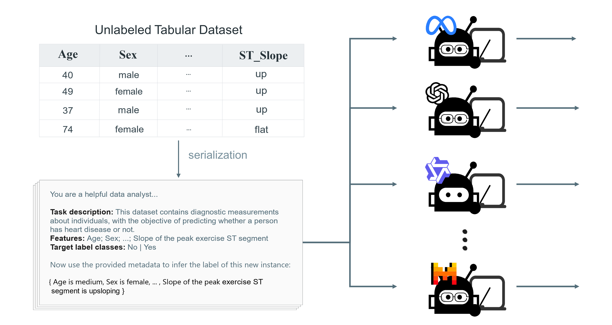
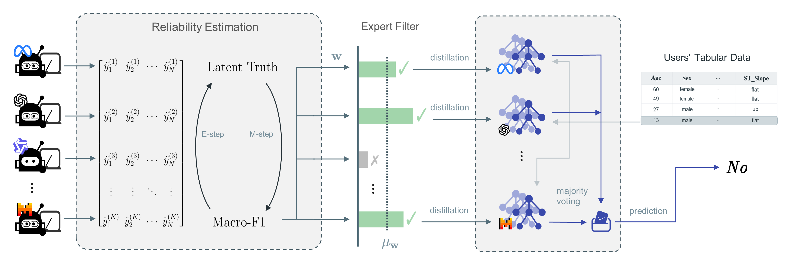

# MELD: Distilling LLM Zero-Shot Priors into Heterogeneous Efficient Models for Label-Free Tabular Classification

[](https://opensource.org/licenses/MIT)
[](https://www.python.org/downloads/release/python-380/)

**Official implementation of "MELD: Distilling Zero-Shot Semantic Priors into Heterogeneous Efficient Models for Label-Free Tabular Classification".**

---

## 📖 Overview
**MELD** (**M**odel-**E**nsemble via **L**abel-free **D**istillation) **resolves** the issues of prediction instability and high resource overhead in **Label-Free Tabular Classification** by harnessing the semantic reasoning capabilities of Large Language Models in a zero-shot setting. The framework aggregates LLM predictions using an Unsupervised Estimation Selector and distills this knowledge into efficient, heterogeneous downstream models such as CatBoost and Logistic Regression.

### Framework Architecture

**LLM Teacher Inference** (`save_prediction.py`)

The teacher inference stage generates zero-shot predictions from multiple LLMs. It supports both local inference (vLLM, HuggingFace) and API-based inference (OpenAI), producing diverse semantic predictions for subsequent aggregation.

<div align=center>  </div>

<div style="height: 10px;"></div>

**Student Model Distillation & Deployment** (`new_exp.py`)

The distillation stage aggregates teacher predictions via EM Algorithm, then trains lightweight student models on the generated hard labels, enabling efficient deployment without LLM dependency.

<div align=center>  </div>

---

## 📂 Repository Structure

### 🚀 Core Scripts

| Script | Function |
|:-------|:---------|
| **`serial.py`** | **Data Serialization** — Converts tabular data into textual prompts optimized for LLMs, handling feature binning, schema descriptions, and prompt construction. |
| **`save_prediction.py`** | **Teacher Inference Interface** — Generates and saves zero-shot predictions/probabilities from various LLMs (Llama-3, Qwen, GPT-4o, etc.) using local inference (vLLM/HuggingFace) or API calls (OpenAI). |
| **`new_exp.py`** | **Distillation Engine** — Implements the core MELD logic:<br>• Aggregates LLM votes using EM Algorithm<br>• Trains student models (CatBoost/LR) on hard labels<br>• Evaluates performance metrics (Accuracy/F1) |
| **`test.sh`** | **Pipeline Controller** — Master automation script that orchestrates the complete workflow: gathering LLM predictions, executing zero-shot baselines, and running MELD distillation. |


### 🛠️ Data Utilities (`data_util/`)

| Module | Purpose |
|:-------|:--------|
| **`create_external_datasets.py`** | Raw data loading, initial cleaning, and train/validation/test splitting |
| **`evaluate_external_dataset.py`** | Feature engineering and preprocessing (One-Hot/Ordinal encoding, normalization) |
| **`dataset_process.py`** | LLM response parsing utilities (mapping unstructured text to class labels) |
| **`template.py`** | Prompt template definitions for Zero-Shot classification |

### ⚙️ Configuration (`helper/`)

| File | Content |
|:-----|:--------|
| **`external_datasets_variables.py`** | Dataset metadata including feature descriptions, role prompts, label mappings, and semantic integrity rules |

### 📊 Pre-computed Results & Inference

To facilitate reproducibility and skip the computationally expensive LLM inference step, we provide pre-computed data:

| Directory | Content |
|:-------|:--------|
| **`pkls/5bin_0_shot_prompt/`** | Contains the raw zero-shot inference results from **10 different LLMs** (including Qwen2.5, Llama-3.1, GPT-4o-mini, etc.) across benchmark datasets. `new_exp.py` uses these files as input. |
| **`meld_results/`** | Stores the final classification results of the distilled student models (Logistic Regression and CatBoost/GBDT). |
---

## 🔧 Setup

**1. Clone the Repository**
```bash
git clone https://github.com/yourusername/MELD.git
cd MELD
```

**2. Install Dependencies**

Ensure you have Python 3.8+ and required packages:
```bash
pip install -r requirements.txt
```

**3. Prepare Datasets**

Place raw datasets (`.csv`, `.arff`) in the `datasets/` directory.

---

## 🏃 Quick Start

### Step 1: Serialize Tabular Data
Convert datasets into LLM-readable textual format with semantic descriptions:
```bash
python serial.py --mode meld_bin
```

### Step 2: Generate Teacher Predictions
Run LLM inference to collect zero-shot predictions. Parameters are configured inside `save_prediction.py` (e.g., model paths).
```bash
python save_prediction.py \
    --model <MODEL_NAME> \
    --datafile <DATASET_NAME> \
```

### Step 3: Run MELD Distillation
Aggregate teacher predictions and train efficient student models.

#### Example: Distilling to CatBoost (Ours)
```bash
python new_exp.py \
    --method ours \
    --datafile <DATASET_NAME> \
    --ml_model catboost \
    --distill_mode ensemble \
    --voting expert_simple \
    --auto_temp
```

#### Example: Distilling to Logistic Regression
```bash
python new_exp.py \
    --method ours \
    --datafile <DATASET_NAME> \
    --ml_model lr \
    --distill_mode ensemble \
    --voting expert_simple \
    --auto_temp
```

---

## 📊 Results

- **Intermediate Inference**: The raw outputs from the 10 teacher LLMs are located in: `pkls/5bin_0_shot_prompt`
- **Final Model Performance**: The evaluation metrics (Accuracy/F1) for the distilled student models (LR and GBDT) are saved in: `./meld_result.jsonl`

---

## 📄 License

This project is licensed under the MIT License - see the [LICENSE](LICENSE) file for details.